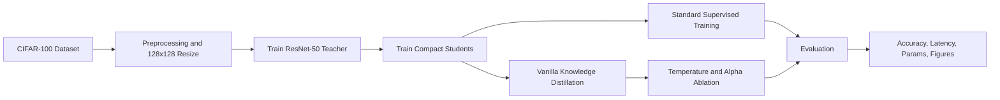
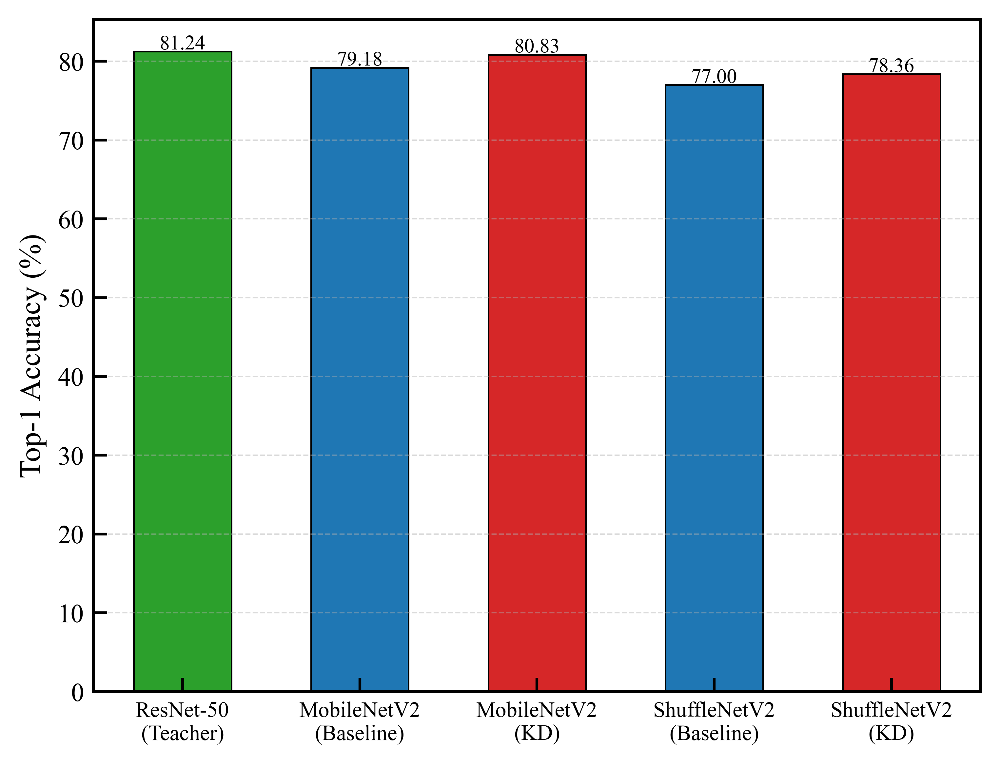
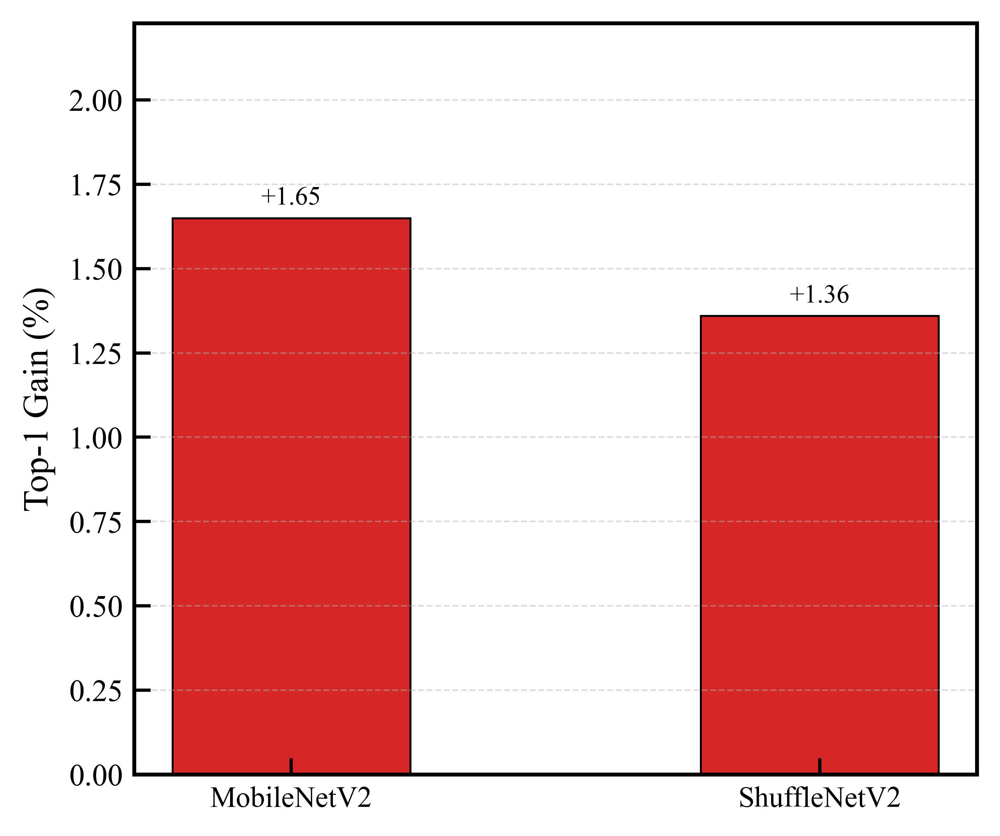
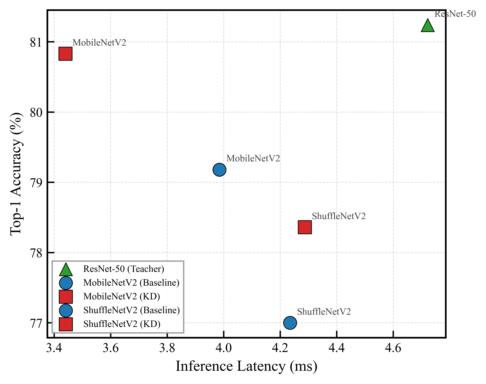
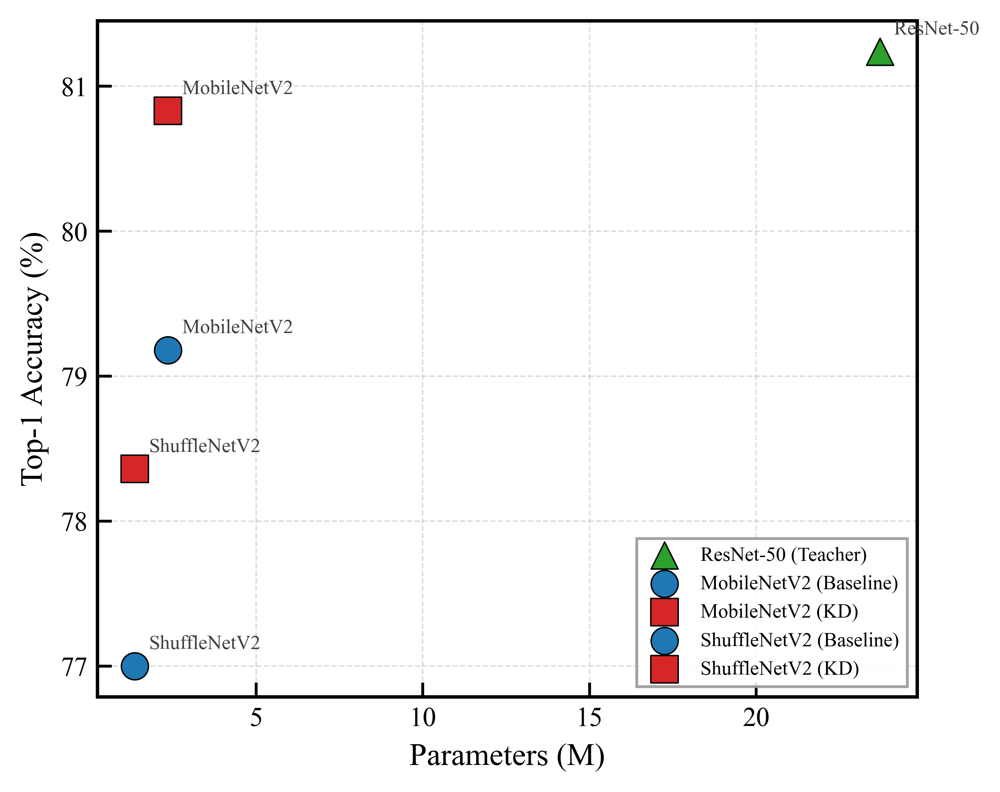
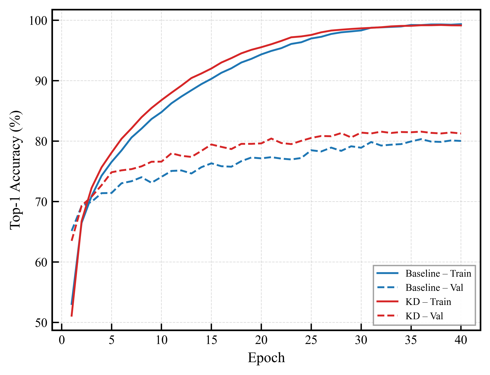
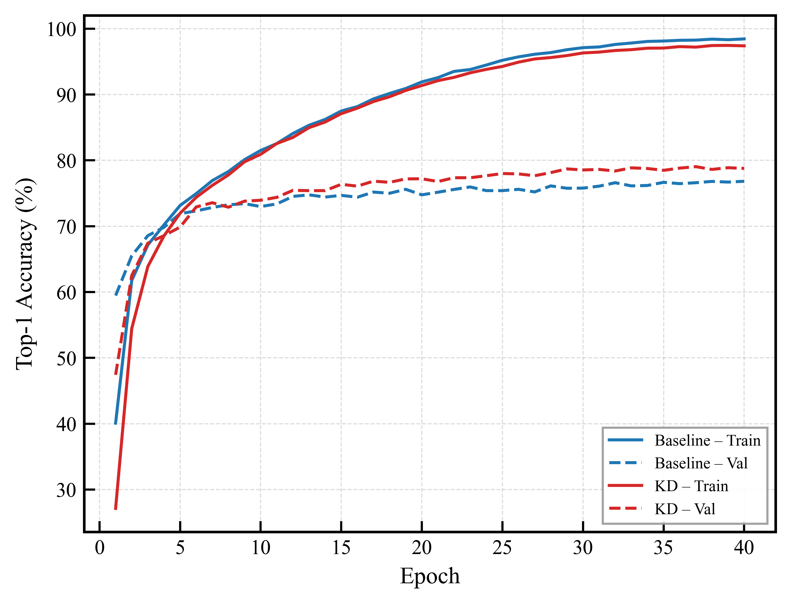
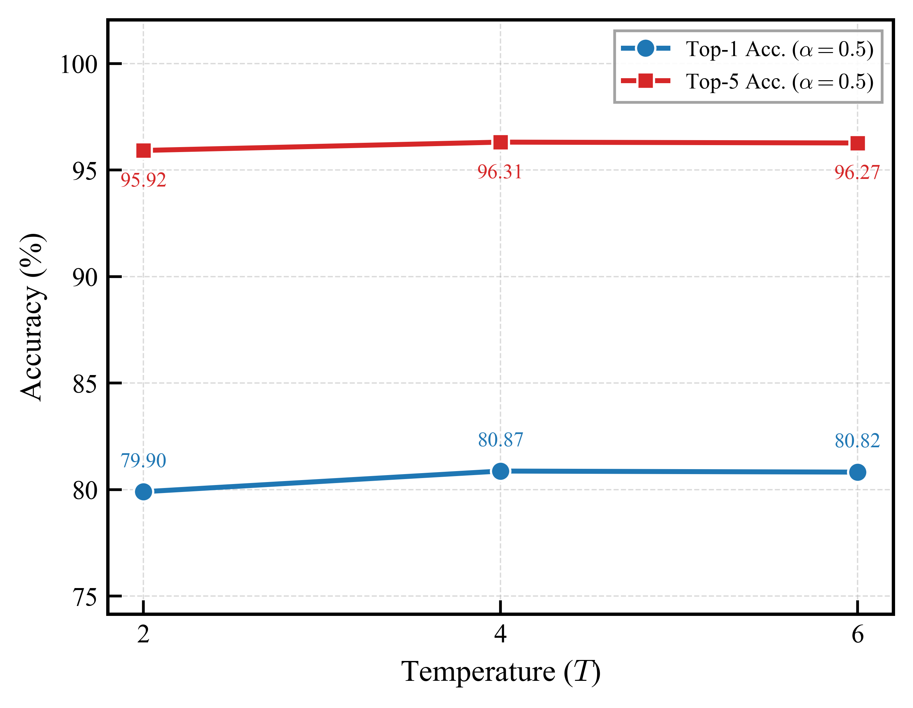
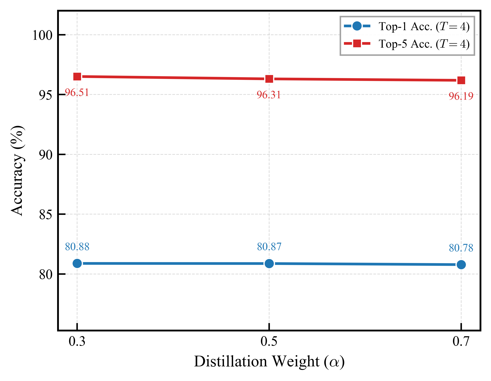

<div align="center">

# Hyperparameter Sensitivity of Vanilla Knowledge Distillation for Compact CNNs on CIFAR-100

**Official repository for the published CNAHPC 2026 paper on vanilla knowledge distillation, compact CNNs, and hyperparameter sensitivity analysis.**

[](https://www.python.org/)
[](https://pytorch.org/)
[](https://pytorch.org/vision/stable/index.html)
[](https://www.cs.toronto.edu/~kriz/cifar.html)
[](#knowledge-distillation-objective)
[](LICENSE)
[](https://doi.org/10.47709/cnahpc.v8i2.8239)

</div>

---

## Paper

> **Hyperparameter Sensitivity of Vanilla Knowledge Distillation for Compact CNNs on CIFAR-100**  
> **Mochamad Rizal Fauzan**, Raden Muhammad Rafi Rachman, Shifa Rangga Saputra, and Daffa Irsyad Nugraha  
> *Journal of Computer Networks, Architecture and High Performance Computing*, Vol. 8, No. 2, pp. 235--246, April 2026  
> DOI: [`10.47709/cnahpc.v8i2.8239`](https://doi.org/10.47709/cnahpc.v8i2.8239)

---

## Table of Contents

- [Overview](#overview)
- [Research Motivation](#research-motivation)
- [Main Contributions](#main-contributions)
- [Method Summary](#method-summary)
- [Knowledge Distillation Objective](#knowledge-distillation-objective)
- [Evaluation Metrics](#evaluation-metrics)
- [Experimental Setup](#experimental-setup)
- [Key Results](#key-results)
- [Hyperparameter Sensitivity](#hyperparameter-sensitivity)
- [Figures](#figures)
- [Repository Structure](#repository-structure)
- [Installation](#installation)
- [Dataset](#dataset)
- [Usage](#usage)
- [Outputs](#outputs)
- [Reproducibility Checklist](#reproducibility-checklist)
- [Included and Excluded Files](#included-and-excluded-files)
- [Citation](#citation)
- [License](#license)
- [Contact](#contact)

---

## Overview

This repository contains the implementation and experimental artifacts for a controlled study of **vanilla knowledge distillation (KD)** on **CIFAR-100**. The study investigates how two fundamental KD hyperparameters affect compact convolutional neural networks:

- **Temperature scaling** **$T$**
- **Loss balancing coefficient** **$\alpha$**

A **ResNet-50** model is used as the teacher, while **MobileNetV2** and **ShuffleNetV2 x1.0** are used as compact student architectures. The experiments compare standard supervised training and distillation-based training under the same dataset split, preprocessing pipeline, optimizer, scheduler, and evaluation protocol.

The repository is designed to make the published results easier to inspect, reproduce, and extend.

---

## Research Motivation

Compact CNNs are attractive for resource-constrained deployment because they reduce memory and computational requirements. However, their lower representational capacity often leads to reduced classification accuracy. Knowledge distillation is a practical strategy for improving compact models without modifying their inference architecture.

Despite its popularity, vanilla KD is often applied using default or inherited hyperparameters. This repository supports the paper's central question:

> **How sensitive is vanilla knowledge distillation to temperature scaling and loss balancing when applied to compact CNNs on CIFAR-100?**

---

## Main Contributions

This repository supports the following contributions:

1. **A controlled vanilla KD benchmark** using ResNet-50 as teacher and MobileNetV2 / ShuffleNetV2 x1.0 as compact students on CIFAR-100.
2. **Accuracy-efficiency evaluation** covering top-1 accuracy, top-5 accuracy, parameter count, inference latency, and training time.
3. **Hyperparameter sensitivity analysis** for temperature scaling **$T$** and loss balancing **$\alpha$**.
4. **Publication-ready outputs** including result summaries, training histories, and figures for accuracy, KD gains, and efficiency trade-offs.

---

## Method Summary

The experimental pipeline consists of three main stages:



The teacher model is trained first using standard cross-entropy supervision. The trained teacher then provides softened probability distributions for the student models during distillation. The student is optimized using a combination of hard-label supervision and teacher-guided soft-target alignment.

---

## Knowledge Distillation Objective

Let:

- $x$: input image
- $y$: ground-truth label
- $z_s$: student logits
- $z_t$: teacher logits
- $T$: temperature scaling parameter
- $\alpha$: hard-label loss balancing coefficient
- $C$: number of classes

The standard cross-entropy loss is defined as:

$$\mathcal{L}_{CE} = -\sum_{c=1}^{C} y_c \log p_s(c)$$

where:

$$p_s(c) = \mathrm{softmax}(z_s)_c$$

The softened teacher probability distribution is computed as:

$$p_t^{T}(c) = \frac{\exp(z_t^c / T)}{\sum_{j=1}^{C} \exp(z_t^j / T)}$$

The softened student probability distribution is computed as:

$$p_s^{T}(c) = \frac{\exp(z_s^c / T)}{\sum_{j=1}^{C} \exp(z_s^j / T)}$$

The distillation loss is based on Kullback-Leibler divergence:

$$\mathcal{L}_{KL} = D_{KL}\left(p_t^{T} \parallel p_s^{T}\right)$$

The final vanilla knowledge distillation objective is:

$$\mathcal{L}_{KD} = \alpha\mathcal{L}_{CE} + (1-\alpha)T^2D_{KL}\left(p_t^{T} \parallel p_s^{T}\right)$$

The $T^2$ term follows the common KD formulation and compensates for the gradient scaling effect introduced by temperature smoothing.

---

## Evaluation Metrics

### Top-k Accuracy

Top - $k$ accuracy measures whether the ground-truth label appears among the model's top-$k$ predictions:

$$\mathrm{Top}\text{-}k = \frac{1}{N}\sum_{i=1}^{N}\mathbf{1}\left[y_i \in \mathrm{Top}\text{-}k(\hat{p}_i)\right]\times 100\%$$

where $N$ is the number of test samples and $\hat{p}_i$ is the predicted class-probability distribution for sample $i$.

### KD Accuracy Gain

The top-1 accuracy improvement from knowledge distillation is computed as:

$$\Delta_{Top1} = Acc_{Top1}^{KD} - Acc_{Top1}^{Standard}$$

The top-5 accuracy improvement from knowledge distillation is computed as:

$$\Delta_{Top5} = Acc_{Top5}^{KD} - Acc_{Top5}^{Standard}$$

### Latency

Inference latency is reported in milliseconds per image:

$$\mathrm{Latency} = \frac{1}{N}\sum_{i=1}^{N}t_i$$

where $t_i$ is the inference time for sample $i$ after warm-up and GPU synchronization.

---

## Experimental Setup

| Component | Configuration |
|---|---|
| Dataset | CIFAR-100 |
| Original image size | 32 x 32 |
| Resized input size | 128 x 128 |
| Number of classes | 100 |
| Teacher model | ResNet-50 |
| Student models | MobileNetV2, ShuffleNetV2 x1.0 |
| Training split | 45,000 images |
| Validation split | 5,000 images |
| Test split | 10,000 images |
| Split seed | 42 |
| Optimizer | AdamW |
| Learning rate | 0.001 |
| Weight decay | 0.0001 |
| Batch size | 128 |
| Scheduler | CosineAnnealingLR |
| Precision | Automatic mixed precision |
| Gradient clipping | 1.0 |
| Teacher initialization | ImageNet pretrained |
| Student initialization | ImageNet pretrained |
| Selection criterion | Best validation top-1 accuracy |

---

## Key Results

### Overall Performance

| Model | Training Type | Params (M) | Best Val Top-1 (%) | Test Loss | Top-1 (%) | Top-5 (%) | Latency (ms) | Train Time (s) |
|---|---:|---:|---:|---:|---:|---:|---:|---:|
| ResNet-50 | Teacher | 23.71 | 82.04 | 0.9568 | 81.24 | 96.05 | 4.72 | 5677.43 |
| MobileNetV2 | Standard | 2.35 | 80.32 | 1.0382 | 79.18 | 95.77 | 3.98 | 5304.86 |
| MobileNetV2 | KD | 2.35 | 81.56 | 1.0814 | 80.83 | 96.40 | 3.44 | 5471.55 |
| ShuffleNetV2 x1.0 | Standard | 1.36 | 76.82 | 1.0456 | 77.00 | 94.81 | 4.23 | 5006.53 |
| ShuffleNetV2 x1.0 | KD | 1.36 | 79.04 | 1.2488 | 78.36 | 95.45 | 4.29 | 5308.46 |

### Knowledge Distillation Gains

| Student Model | Top-1 Gain | Top-5 Gain | Latency Change |
|---|---:|---:|---:|
| MobileNetV2 | +1.65 | +0.63 | -0.54 ms |
| ShuffleNetV2 x1.0 | +1.36 | +0.64 | +0.05 ms |

### Main Observation

Knowledge distillation improved both compact students. MobileNetV2 achieved the strongest compact-model result with **80.83% top-1 accuracy**, **96.40% top-5 accuracy**, and lower latency than its standard baseline. ShuffleNetV2 x1.0 also improved clearly in accuracy, with only a marginal latency increase.

---

## Hyperparameter Sensitivity

### Temperature Scaling Ablation

The temperature study was conducted on MobileNetV2 using \(\alpha = 0.5\).

| Temperature | Alpha | Best Val Top-1 (%) | Top-1 (%) | Top-5 (%) |
|---:|---:|---:|---:|---:|
| 2 | 0.5 | 80.26 | 79.90 | 95.92 |
| 4 | 0.5 | 81.08 | 80.87 | 96.31 |
| 6 | 0.5 | 81.60 | 80.82 | 96.27 |

### Loss Balancing Ablation

The loss balancing study was conducted on MobileNetV2 using \(T = 4\).

| Alpha | Temperature | Best Val Top-1 (%) | Top-1 (%) | Top-5 (%) |
|---:|---:|---:|---:|---:|
| 0.3 | 4 | 81.36 | 80.88 | 96.51 |
| 0.5 | 4 | 81.08 | 80.87 | 96.31 |
| 0.7 | 4 | 81.02 | 80.78 | 96.19 |

### Best Ablation Configuration

```text
Student      : MobileNetV2
Temperature  : T = 4
Alpha        : alpha = 0.3
Top-1        : 80.88%
Top-5        : 96.51%
```

The ablation results indicate that vanilla KD is not merely a plug-and-play training strategy. Its effectiveness depends on the balance between task fidelity from ground-truth labels and transferable information from softened teacher predictions.

---

## Figures

### Overall Top-1 Accuracy Comparison



### KD Gain per Student Model



### Accuracy-Latency Trade-off



### Accuracy-Parameter Trade-off



### Training Curves





### Hyperparameter Sensitivity





---

## Repository Structure

```text
.
├── README.md
├── LICENSE
├── CITATION.bib
├── requirements.txt
├── train_kd_cifar100_paper_ready.py
└── outputs_kd_paper_ready/
    ├── results_summary.csv
    ├── results_summary.json
    ├── kd_gain_summary.csv
    ├── kd_gain_summary.json
    ├── ablation_results.csv
    ├── ablation_results.json
    ├── figures/
    │   ├── bar_top1_comparison.png
    │   ├── bar_kd_gain.png
    │   ├── scatter_accuracy_vs_latency.png
    │   ├── scatter_accuracy_vs_params.png
    │   ├── curve_mobilenet_v2.png
    │   ├── curve_shufflenet_v2_x1_0.png
    │   ├── ablation_top1_vs_temperature.png
    │   └── ablation_top1_vs_alpha.png
    ├── logs/
    │   ├── mobilenet_v2_standard_history.json
    │   ├── mobilenet_v2_kd_history.json
    │   ├── shufflenet_v2_x1_0_standard_history.json
    │   ├── shufflenet_v2_x1_0_kd_history.json
    │   └── resnet50_standard_history.json
    └── ablation/
        ├── mobilenet_v2_ablation_temperature_2_history.json
        ├── mobilenet_v2_ablation_temperature_4_history.json
        ├── mobilenet_v2_ablation_temperature_6_history.json
        ├── mobilenet_v2_ablation_alpha_0.3_history.json
        ├── mobilenet_v2_ablation_alpha_0.5_history.json
        └── mobilenet_v2_ablation_alpha_0.7_history.json
```

Large raw datasets and checkpoint files are intentionally excluded from this repository.

---

## Installation

### 1. Clone Repository

```bash
git clone https://github.com/rizalfanex/kd-hyperparameter-sensitivity-cifar100.git
cd kd-hyperparameter-sensitivity-cifar100
```

### 2. Create Environment

Using `venv`:

```bash
python -m venv .venv
```

Activate the environment.

Windows PowerShell:

```powershell
.\.venv\Scripts\Activate.ps1
```

Linux or macOS:

```bash
source .venv/bin/activate
```

### 3. Install Dependencies

```bash
python -m pip install --upgrade pip
python -m pip install -r requirements.txt
```

### 4. Install PyTorch

Install the PyTorch build that matches your CUDA version. The reported experiments used PyTorch 2.11.0 with CUDA 13.0.

```bash
python -m pip install torch==2.11.0+cu130 torchvision==0.26.0+cu130 -f https://download.pytorch.org/whl/cu130/torch_stable.html
```

If your machine uses a different CUDA version or CPU-only setup, install PyTorch from the official selector:

```text
https://pytorch.org/get-started/locally/
```

---

## Dataset

This project uses **CIFAR-100**. The raw dataset is not included in the repository because dataset archives and extracted files are large and should not be committed to GitHub.

The training script uses `torchvision.datasets.CIFAR100`, which can download and prepare the dataset automatically.

```python
torchvision.datasets.CIFAR100(
    root="./data",
    train=True,
    download=True,
    transform=...
)
```

Dataset split used in the experiments:

| Split | Number of Images |
|---|---:|
| Training | 45,000 |
| Validation | 5,000 |
| Test | 10,000 |

---

## Usage

### Run Full Training Pipeline

```bash
python train_kd_cifar100_paper_ready.py
```

This will train and evaluate:

- ResNet-50 teacher
- MobileNetV2 standard baseline
- MobileNetV2 with KD
- ShuffleNetV2 x1.0 standard baseline
- ShuffleNetV2 x1.0 with KD

### Run Ablation Only

```bash
python train_kd_cifar100_paper_ready.py --ablation-only
```

This runs MobileNetV2 ablation experiments for:

- \(T = 2, 4, 6\)
- \(\alpha = 0.3, 0.5, 0.7\)

### Expected Output Directory

```text
outputs_kd_paper_ready/
```

---

## Outputs

The script produces several output files for analysis and reporting.

| File | Description |
|---|---|
| `results_summary.csv` | Overall teacher and student results |
| `results_summary.json` | JSON version of the overall results |
| `kd_gain_summary.csv` | Accuracy and latency gain from KD |
| `kd_gain_summary.json` | JSON version of KD gain summary |
| `ablation_results.csv` | Temperature and alpha ablation results |
| `ablation_results.json` | JSON version of ablation results |
| `logs/*_history.json` | Training history for each main model |
| `ablation/*_history.json` | Training history for each ablation run |
| `figures/*.png` | Publication-ready figures |

---

## Reproducibility Checklist

For closer reproduction of the published results, use the following settings:

- [x] CIFAR-100 benchmark dataset
- [x] 128 x 128 resized input resolution
- [x] ImageNet-pretrained teacher and student backbones
- [x] ResNet-50 teacher
- [x] MobileNetV2 and ShuffleNetV2 x1.0 students
- [x] AdamW optimizer
- [x] Learning rate of 0.001
- [x] Weight decay of 0.0001
- [x] Batch size of 128
- [x] Cosine annealing scheduler
- [x] Mixed precision training
- [x] Random seed 42
- [x] Best checkpoint selected using validation top-1 accuracy
- [x] Latency measured with warm-up and GPU synchronization

Expected minor variations may occur because of hardware, CUDA/cuDNN behavior, PyTorch version, GPU timing variation, and random numerical effects.

---

## Included and Excluded Files

### Included

This repository includes:

- training and evaluation code;
- result summaries;
- ablation summaries;
- training histories;
- figure files;
- citation metadata;
- license file.

### Excluded

The following files are intentionally excluded:

- raw CIFAR-100 files;
- `.tar.gz`, `.gz`, `.zip`, and `.rar` archives;
- `.pt`, `.pth`, `.ckpt`, and `.onnx` model weights;
- Python cache files;
- local environment folders.

This keeps the repository lightweight and avoids GitHub's 100 MB file-size limit.

---

## Citation

If you use this repository, please cite the paper:

```bibtex
@article{fauzan2026kdhyperparameter,
  title   = {Hyperparameter Sensitivity of Vanilla Knowledge Distillation for Compact CNNs on CIFAR-100},
  author  = {Fauzan, Mochamad Rizal and Rachman, Raden Muhammad Rafi and Saputra, Shifa Rangga and Nugraha, Daffa Irsyad},
  journal = {Journal of Computer Networks, Architecture and High Performance Computing},
  volume  = {8},
  number  = {2},
  pages   = {235--246},
  year    = {2026},
  doi     = {10.47709/cnahpc.v8i2.8239}
}
```

A BibTeX entry is also provided in [`CITATION.bib`](CITATION.bib).

---

## License

This repository is released under the MIT License. See [`LICENSE`](LICENSE) for details.

---

## Contact

For questions, reproducibility issues, or discussion, please open an issue in this repository:

```text
https://github.com/rizalfanex/kd-hyperparameter-sensitivity-cifar100/issues
```

---

<div align="center">

**If this repository is useful, please consider citing the paper and starring the repository.**

</div>
